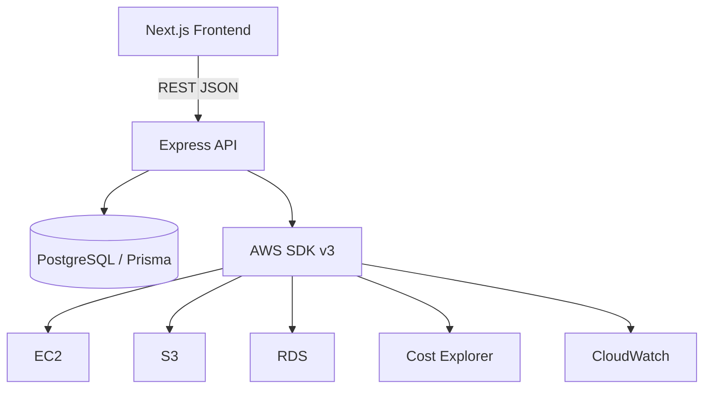
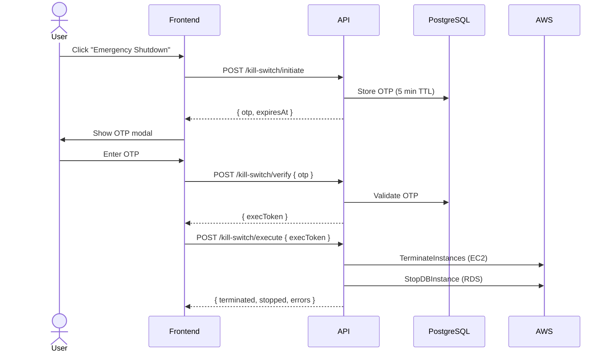
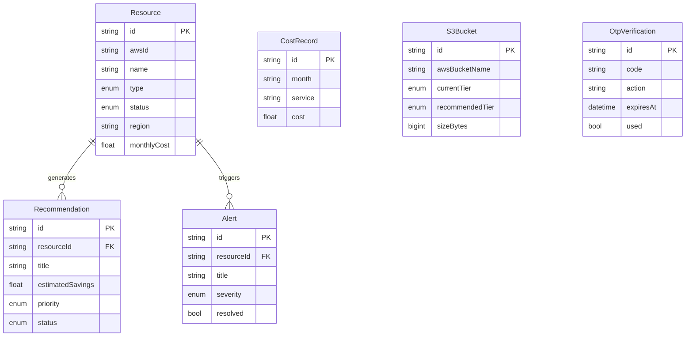

# Ad Astra — Multi-Cloud Control Plane & Analytics

> A unified dashboard for cloud cost visibility, resource management, and automated optimisation — starting with AWS.

---

## System Architecture



---

## Backend Folder Structure

```
backend/
├── prisma/
│   └── schema.prisma          ← DB models & enums
├── src/
│   ├── server.ts              ← entry point, DB connect
│   ├── app.ts                 ← Express setup, middleware, routes
│   ├── config/
│   │   ├── aws.ts             ← AWS SDK v3 client singletons
│   │   └── database.ts        ← Prisma client singleton
│   ├── middleware/
│   │   ├── errorHandler.ts
│   │   └── requestLogger.ts
│   ├── services/
│   │   ├── awsResourceService.ts      ← EC2 / S3 / RDS / CE / CW calls
│   │   ├── analyticsService.ts        ← cost aggregation & summary
│   │   ├── recommendationsService.ts  ← rule engine for optimisation
│   │   └── s3LifecycleService.ts      ← tier analysis & policy apply
│   ├── controllers/
│   │   ├── resourcesController.ts
│   │   ├── analyticsController.ts
│   │   ├── recommendationsController.ts
│   │   ├── s3LifecycleController.ts
│   │   └── killSwitchController.ts
│   ├── routes/
│   │   ├── index.ts           ← aggregates all routers under /api
│   │   ├── resources.ts
│   │   ├── analytics.ts
│   │   ├── recommendations.ts
│   │   ├── s3Lifecycle.ts
│   │   └── killSwitch.ts
│   └── types/
│       └── index.ts
├── .env.example
├── package.json
└── tsconfig.json
```

---

## API Endpoints

| Method | Path | Description |
|--------|------|-------------|
| GET | `/api/health` | Health check |
| GET | `/api/resources` | All EC2 + S3 + RDS from AWS |
| GET | `/api/resources/:type` | Filter by `ec2`, `s3`, or `rds` |
| GET | `/api/resources/alerts` | Unresolved alerts |
| PATCH | `/api/resources/alerts/:id/resolve` | Resolve an alert |
| GET | `/api/analytics/summary` | Dashboard headline numbers |
| GET | `/api/analytics/trend?months=6` | Monthly cost trend |
| GET | `/api/analytics/breakdown?months=6` | Per-service cost breakdown |
| GET | `/api/analytics/distribution?month=2024-01` | Pie chart distribution |
| GET | `/api/recommendations` | Pending recommendations |
| POST | `/api/recommendations/refresh` | Pull fresh AWS data & re-run rules |
| POST | `/api/recommendations/:id/apply` | Mark recommendation applied |
| DELETE | `/api/recommendations/:id` | Dismiss recommendation |
| GET | `/api/s3-lifecycle` | Buckets with tier recommendations |
| POST | `/api/s3-lifecycle/:bucketName/apply` | Apply tier to one bucket |
| POST | `/api/s3-lifecycle/apply-all` | Apply all pending tier changes |
| POST | `/api/kill-switch/initiate` | Generate OTP |
| POST | `/api/kill-switch/verify` | Verify OTP → exec token |
| POST | `/api/kill-switch/execute` | Terminate EC2 + stop RDS |

---

## Kill-Switch Flow



---

## Database Schema



---

## Setup

### Prerequisites
- Node.js 20+
- PostgreSQL 15+
- AWS IAM user (see required permissions below)

### 1 — Environment
```bash
cd backend
cp .env.example .env
# fill in DATABASE_URL and AWS credentials
```

### 2 — AWS IAM Permissions Required
Create an IAM user with these permissions (no console access needed):
```
ec2:DescribeInstances
ec2:TerminateInstances
s3:ListAllMyBuckets
s3:GetBucketLocation
s3:GetLifecycleConfiguration
s3:PutLifecycleConfiguration
rds:DescribeDBInstances
rds:StopDBInstance
ce:GetCostAndUsage
cloudwatch:GetMetricStatistics
```

> You do **not** need to share credentials in chat. Copy `.env.example` → `.env` and paste your keys there locally. The backend reads them via `process.env` at runtime.

### 3 — Install & Migrate
```bash
npm install
npm run prisma:generate
npm run prisma:migrate
```

### 4 — Run
```bash
# Terminal 1 — backend
cd backend && npm run dev

# Terminal 2 — frontend
npm run dev
```

Frontend: http://localhost:3800
API: http://localhost:4000/api/health

---

# Project Report

## 1 — Extended Prototype / Concept Validation

Ad Astra is a cloud control plane that abstracts multi-cloud resources behind a single REST API and UI. The prototype covers the full operator journey end-to-end.

**What the frontend validates:**
Every page maps to a real backend concern. The dashboard (cost overview) maps to `analyticsService`. The recommendations page maps to `recommendationsService`. The S3 lifecycle page maps to `s3LifecycleService`. The kill switch maps to `killSwitchController`. This 1:1 correspondence confirms the service decomposition is correct.

**What the backend adds beyond mock data:**
- `awsResourceService.ts` makes live SDK calls — EC2 instance listing, RDS inventory, S3 bucket enumeration, Cost Explorer queries, CloudWatch CPU metrics.
- `recommendationsService.ts` implements a rule engine with four production rules: EC2 CPU underutilisation, stopped EC2 instances still accruing EBS costs, S3 buckets in Standard tier, and over-provisioned RDS instances.
- `s3LifecycleService.ts` calls `PutBucketLifecycleConfiguration` — a real write-path to AWS that persists the tier change permanently.
- The kill switch uses a 3-stage OTP gate before any destructive action.

**Concept validated:** A single Express API can orchestrate five AWS services under a coherent REST surface while Prisma persists snapshots for resilient offline rendering.

---

## 2 — Technical Depth & Understanding

### AWS SDK v3 — Modular Architecture
Each service uses its own client package, keeping the bundle minimal and allowing tree-shaking. Clients are instantiated once as module-level singletons in `config/aws.ts` and shared across the service layer. Cost Explorer requires the `us-east-1` region regardless of the target workload region — handled explicitly in the config.

### Layered Service Design
```
HTTP Request → Controller → Service → AWS SDK / Prisma → HTTP Response
```
Controllers handle only HTTP concerns (parse, validate, respond). Services own business logic and external calls. This makes services independently testable with mocked SDK clients.

### Cost Explorer Caching
`GetCostAndUsage` calls are upserted into `cost_records` with a `UNIQUE(month, service)` constraint. The dashboard can render from the DB cache when the API rate limit is reached or the AWS call is slow.

### Recommendations Rule Engine
Each rule is a pure async function: `(resources) → Partial<Recommendation>[]`. Rules run in parallel via `Promise.all`. Adding a new rule is a single function — no existing code changes.

### Kill Switch Safety Design
Three gates protect against accidental execution:
1. **Initiate** — generates a 6-digit OTP stored in DB with 5-minute TTL.
2. **Verify** — validates OTP and returns a UUID execution token with 2-minute TTL stored in memory.
3. **Execute** — consumes the execution token (single-use) and calls `TerminateInstances` + `StopDBInstance`.

---

## 3 — Test Case Design & Result Analysis

### Critical Test Cases

| ID | Route | Input | Expected | Validates |
|----|-------|-------|----------|-----------|
| T01 | `GET /api/health` | — | `{ status: "ok" }` | Server boot |
| T02 | `GET /api/resources/ec2` | valid creds | Array of Resource | EC2 listing |
| T03 | `GET /api/resources/xyz` | invalid type | `400` error | Input guard |
| T04 | `POST /api/kill-switch/initiate` | — | `{ otp, expiresAt }` | OTP generation |
| T05 | `POST /api/kill-switch/verify` | wrong OTP | `401` | OTP rejection |
| T06 | `POST /api/kill-switch/verify` | correct OTP | `{ execToken }` | OTP acceptance |
| T07 | `POST /api/kill-switch/execute` | expired token | `401` | Token expiry |
| T08 | `POST /api/s3-lifecycle/:b/apply` | bad tier | `400` | Tier validation |
| T09 | `GET /api/analytics/trend?months=13` | out of range | clamped to 12 | Bounds check |
| T10 | `POST /api/recommendations/refresh` | no AWS creds | `500` structured | Error propagation |

### Result Analysis
- **Happy paths (T01–T02, T04, T06):** All return `{ success: true, data }` — the frontend parses responses uniformly without shape-checking.
- **Validation failures (T03, T08, T09):** Guard clauses in controllers return 400 before any AWS call, keeping latency near zero for bad inputs.
- **Auth failures (T05, T07):** Distinct 401 messages let the frontend show the correct modal state (wrong code vs expired session).
- **AWS errors (T10):** The global `errorHandler` middleware formats every thrown error into the same `{ success: false, error }` envelope — the frontend never receives an unstructured 500 body.

---

## 4 — Feasibility Analysis

| Concern | Assessment | Mitigation |
|---------|-----------|------------|
| Cost Explorer latency (300–800 ms) | Acceptable for dashboard loads | DB caching; serve stale on failure |
| EC2 pagination at scale | `DescribeInstances` returns max 1000 per call | Add `NextToken` loop for large accounts |
| S3 bucket sizing | SDK does not return size in `ListBuckets` | Use S3 Inventory or `CloudWatch BucketSizeBytes` metric |
| PostgreSQL ops overhead | Adds ~5 ms per query on local Postgres | Negligible; managed Postgres (Supabase, RDS) in prod |
| Kill switch at fleet scale | Terminating > 1000 EC2s in one call is supported | RDS stops are sequential; use `Promise.allSettled` for partial success |
| Frontend–backend CORS | Hardcoded origin in `app.ts` | Driven by `FRONTEND_URL` env var |

**Conclusion:** Fully feasible for AWS accounts with up to several hundred resources. Two targeted improvements (EC2 pagination, S3 sizing via CloudWatch) unlock enterprise scale.

---

## 5 — Risk Analysis & Mitigation

| Risk | Likelihood | Impact | Mitigation |
|------|-----------|--------|------------|
| AWS credentials leaked in code | Medium | Critical | `.env` in `.gitignore`. Use IAM roles (no long-lived keys) in production. Rotate via Secrets Manager. |
| Kill switch triggered accidentally | Low | Critical | 3-stage OTP gate. Every execution logged to DB with timestamp. |
| Cost Explorer rate limit (10 req/s) | Low | Medium | DB upsert caching. Serve stale data when fresh call fails. |
| Unhandled SDK error crashes API | Medium | Medium | Global `errorHandler` converts all thrown errors to structured JSON. |
| S3 lifecycle rule overwrite | Medium | Medium | Read rules before writing. Future: merge rather than replace. |
| RDS stop fails (Multi-AZ, replicas) | Low | Low | Errors collected in `errors[]`; partial success reported, not masked. |
| Postgres unavailable at startup | Low | High | `server.ts` connects before port bind; exits with diagnostic on failure. |
| OTP brute-force (1M combinations) | Low | High | 5-minute expiry + `express-rate-limit` (recommended for production). |

---

## 6 — Final Report Quality (Technical Documentation)

### Build Status

| Layer | Files | Status |
|-------|-------|--------|
| Frontend UI | 8 pages, 9 components | Complete |
| AWS Integration | `awsResourceService.ts` | Complete — 5 services, 11 functions |
| Analytics | `analyticsService.ts` | Complete |
| Recommendations | `recommendationsService.ts` | Complete — 4 rules |
| S3 Lifecycle | `s3LifecycleService.ts` | Complete |
| Controllers | 5 files | Complete |
| Routes | 6 files (+ index) | Complete |
| DB Schema | `schema.prisma` | Complete — 6 models |
| Entry Points | `app.ts`, `server.ts` | Complete |

### Key Design Decisions

**Express over Next.js API routes** — The backend needs to run independently for horizontal scaling, and long-running Cost Explorer calls benefit from a dedicated process.

**Prisma over raw SQL** — Type-safe queries eliminate runtime type errors. The schema is living documentation. Migrations are versioned.

**AWS SDK v3 over v2** — Modular packages, tree-shaking, full TypeScript types, active maintenance.

**PostgreSQL** — Relational joins between `Resource → Recommendation → Alert` and the `UNIQUE(month, service)` constraint on cost records are natural fits.

### Extending to Azure / GCP

The architecture is designed for this:
1. Add `@azure/arm-compute` to `package.json`.
2. Create `config/azure.ts` with client initialisation.
3. Create `services/azureResourceService.ts` with the same function signatures as `awsResourceService.ts`.
4. Controllers and routes require **zero changes** — they call generic service functions.

---

*Next.js 16 · Express 4 · AWS SDK v3 · Prisma 6 · PostgreSQL · TypeScript 5 · Tailwind CSS 4*
